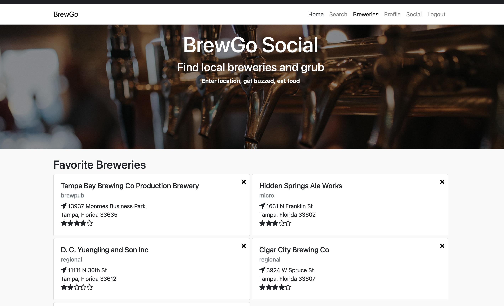
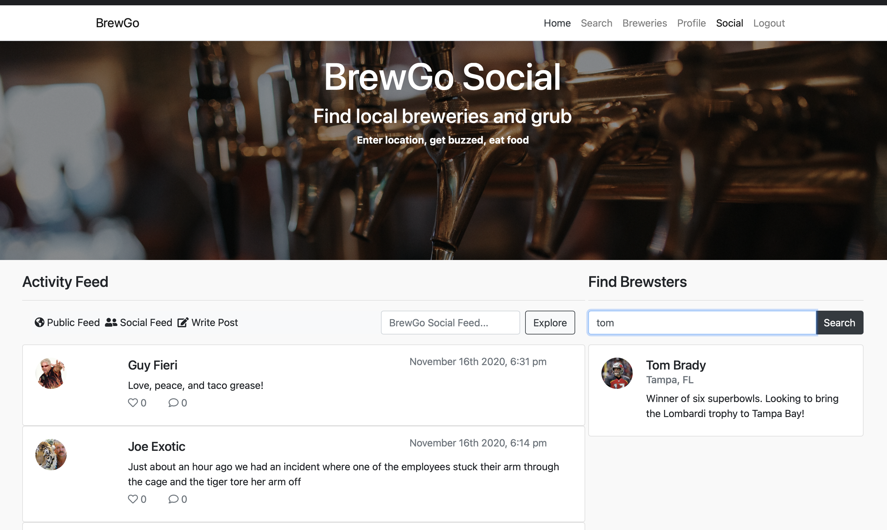
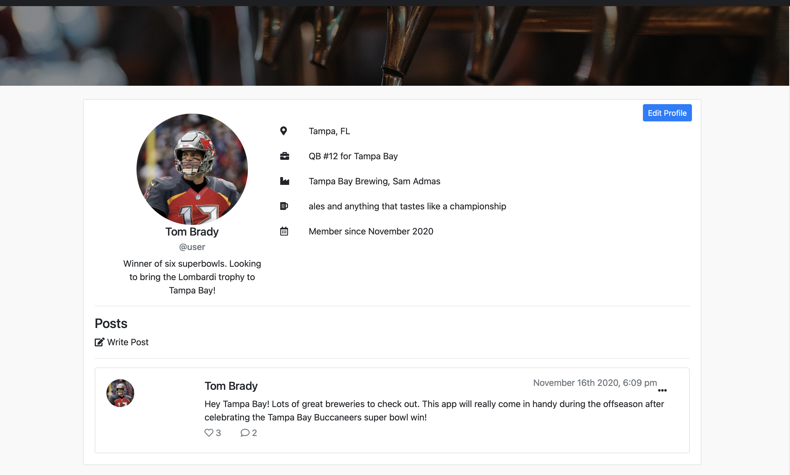

# BrewGoSocial

## Find local breweries and grub

BrewGo's mission is to be a resource for people to look up breweries in their area and cross reference restaurants in the same area

Whether you're a frequent travelor or a craft beer drinker searching for breweries nearby, BrewGo is the perfect resource for finding quality breweries and restaurants.

In addition to brewery and restaurant searching, you can connect with other users via BrewGo Social

### Enter location, get buzzed, eat food

## Technologies
- UI : Angular, TypeScript, Bootstrap CSS
- API : Asp.net Core, EntityFramework Core, C#

Demo: https://brewgo.azurewebsites.net/

-   Login: user
-   Password: password

## Homepage

## Brewery Search

## Favorite Breweries

## BrewGo Social

## User Profile

